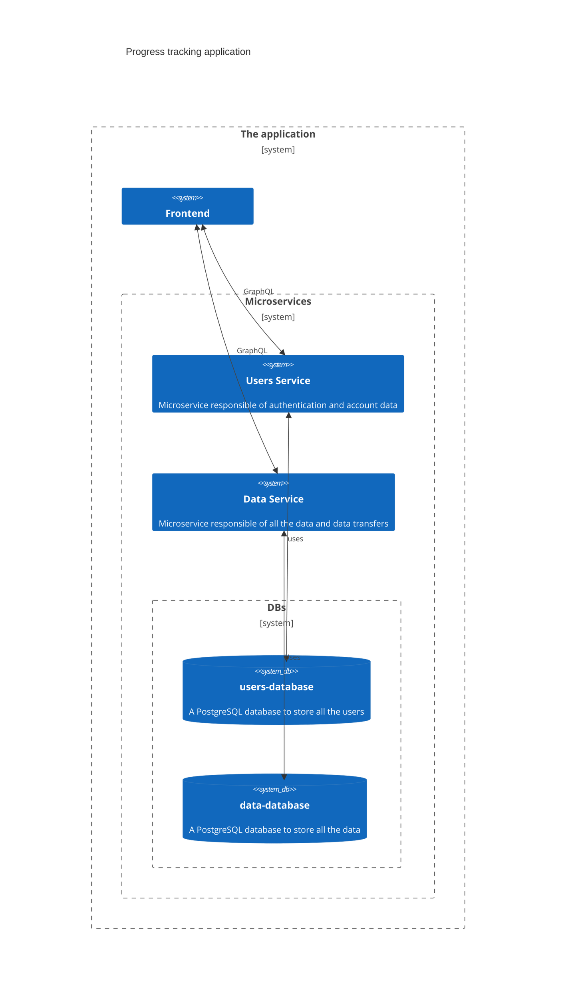

## Table of Content
- [The App](#the-app)
- [Tech Used](#tech-used)
- [Project Structure](#project-structure)
- [Installation](#Installation)
    - [Local](#local)
    - [Docker Compose](#docker-compose)
    - [Kubernetes](#kubernetes)

## The App
A simple progress tracking app with the following features:
- User authentication (register & login)
- Progress tracking
  - Create and manage trackable items
  - Customize items with icons and colors
  - Reorder items via drag-and-drop
- Customization
  - Multiple theme support

## Tech Used
- The frontend is made with Vite and React
- The backend consists of two Go microservices:
    - users-service for user accounts 
    - data-service for storing data
- Both microservices have their own PostgreSQL databases for storing data
- Each service communicates via GraphQL

rough high-level overview of the application:


## Project Structure
the project is a monorepo containing the following services:
- `client/` - React frontend application
- `data-service/` - Go microservice for data management
- `users-service/` - Go microservice for user authentication

## Testing app in Google Cloud
> [!NOTE]
> The app doesn't use https so please don't use real information if you decide to register or login for your safety.

Available at: [http://34.8.77.235/](http://34.8.77.235/)

## Installation
ggs
### Local
**Prerequisites**
- Node.js 18+ for the frontend
- Go 1.24.3+ for the backend services
- PostgreSQL database for each service

1. Clone this repository
2. Ensure you have 2 psql databases for each microservice. Those must be set as env variables for each microservice. Check both microservices READMEs for more info.
3. Check client README for [installation](/client#installation)
4. Check data-service README for [installation](/users-service#installation)
5. Check users-service README for [installation](/data-service#installation)
6. You should see your application at URL the client gave you.

### Docker Compose

1. Clone this repository
2. Ensure Docker is installed
3. Create .env with the following content
    ```bash
    JWT_KEY=<YOUR_KEY>
    POSTGRES_PASSWORD=<YOUR_PASSWORD>
    ```
4. Run `docker compose up`
5. The app should be available at the URL: `localhost:4173`

### Kubernetes
**Prerequisites**
- k3d installed
- KubeCLI installed
- Probably some basic knowledge of kubernetes

1. Clone this repository
2. Create a k3d cluster: `k3d cluster create --port 8082:30080@agent:0 -p 8081:80@loadbalancer --agents 2`
3. Create secret.yaml files:
```bash
# data-service/manifests/secret.yaml
apiVersion: v1
kind: Secret
metadata:
  name: data-svc-secret
data:
  JWT_KEY: <YOUR_KEY_WITH_BASE64_ENCODING>
  DB_PASSWORD: <YOUR_PASSWORD_WITH_BASE64_ENCODING>

---

# users-service/manifests/secret.yaml
apiVersion: v1
kind: Secret
metadata:
  name: users-svc-secret
data:
  JWT_KEY: <YOUR_KEY_WITH_BASE64_ENCODING>
  DB_PASSWORD: <YOUR_PASSWORD_WITH_BASE64_ENCODING>
```
4. Uncomment the secret.yaml rows in the ./kustomization.yaml file at the root of the project
5. Run `kubectl apply -k .`
6. The application should be available at the URL: `localhost:8081` in a few minutes
