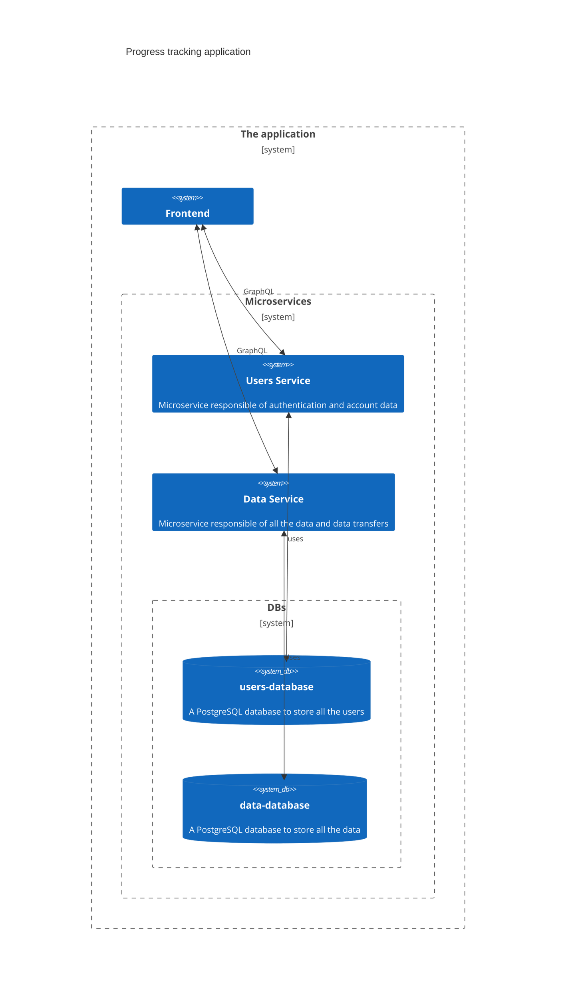

## Table of Content
- [The App](#the-app)
- [Tech Used](#tech-used)
- [Project Structure](#project-structure)
- [Installation](#Installation)
    - [Local](#local)
    - [Docker Compose](#docker-compose)
    - [Kubernetes](#kubernetes)

## The App
A simple progress tracking app with the following features:
- User authentication (register & login)
- Progress tracking
  - Create and manage trackable items
  - Customize items with icons and colors
  - Reorder items via drag-and-drop
- Customization
  - Multiple theme support

## Tech Used
- The frontend is made with Vite and React
- The backend consists of two Go microservices:
    - users-service for user accounts 
    - data-service for storing data
- Both microservices have their own PostgreSQL databases for storing data
- Each service communicates via GraphQL

rough highlevel overview of the application:


## Project Structure
- `client/` - React frontend application
- `data-service/` - Go microservice for data management
- `users-service/` - Go microservice for user authentication

## Installation
### Local
**Prerequisites**
- Node.js 18+ for frontend
- Go 1.24.3+ for backend services
- PostgreSQL databases for each service

1. Clone this repository

### Docker Compose

1. Clone this repository
2. Ensure Docker is installed
3. Create .env with the following content
    ```bash
    JWT_KEY=<YOUR_KEY>
    POSTGRES_PASSWORD=<YOUR_PASSWORD>
    ```
4. Run `docker compose up`
5. The app should be available in url: `localhost:4173`

### Kubernetes
- todo
